# Swap Service Documentation

## Overview

The Swap Service is a comprehensive token swapping system that supports multiple decentralized exchange (DEX) providers and cross-chain bridging capabilities. It orchestrates token swaps across different blockchain networks with automatic path finding, quote optimization, and fee calculation.

## Architecture

### High-Level Architecture

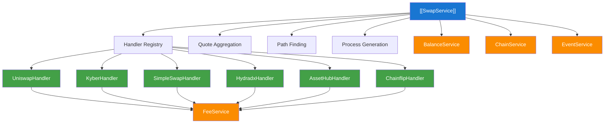

### Service Relationships

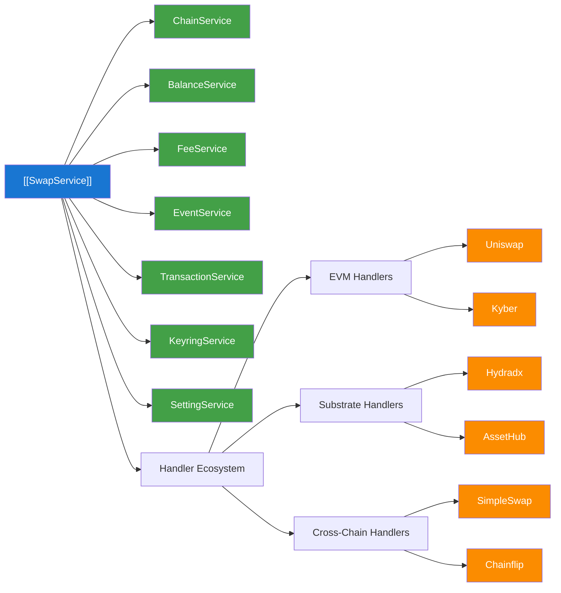

### Component Roles

#### SwapService (Main Orchestrator)
- **Location**: [`/packages/extension-base/src/services/swap-service/index.ts`](./index.ts)
- **Initialization**: Integrated into KoniState at [`/packages/extension-base/src/koni/background/handlers/State.ts:120`](../../koni/background/handlers/State.ts#L120)
- **Purpose**: Central coordinator for all swap operations
- **Responsibilities**:
  - Handler registration and management
  - Quote aggregation from multiple providers
  - Optimal path finding and process generation
  - Swap pair management and subscription
  - Cross-chain routing logic

#### Handler Architecture
All handlers implement the `SwapBaseInterface` defined in [`/packages/extension-base/src/services/swap-service/handler/base-handler.ts`](./handler/base-handler.ts):

- **UniswapHandler**: EVM-based swaps with permit functionality and approval management
- **KyberHandler**: EVM DEX aggregator with gas optimization and quote routing
- **SimpleSwapHandler**: Cross-chain swaps via centralized bridge with native/ERC20 support
- **HydradxHandler**: Substrate-based AMM with referral system and fee token selection
- **AssetHubHandler**: Polkadot/Kusama asset hub native swaps with router integration
- **ChainflipHandler**: Cross-chain atomic swaps with testnet/mainnet configurations

## Swap Provider Details

### Provider Categories & Implementation Types

Based on implementation analysis from [`index.ts:30`](./index.ts#L30), swap providers fall into three categories:

1. **On-Chain Pallet-Based**: HydraDX and AssetHub have dedicated blockchain pallets for native swap execution
2. **Smart Contract-Based**: Uniswap and Kyber interact with DEX smart contracts on EVM chains  
3. **Centralized API-Based**: SimpleSwap and Chainflip use centralized API systems but execute through on-chain transactions

### UniswapHandler - EVM DEX Protocol

**Location**: [`./handler/uniswap-handler.ts`](./handler/uniswap-handler.ts)  
**Provider ID**: `SwapProviderId.UNISWAP` from [`types/swap/index.ts:84`](../../types/swap/index.ts#L84)  
**Supported Chains**: Ethereum, Arbitrum as defined in [`utils.ts:40`](./utils.ts#L40)

#### How Uniswap Swaps Work
1. **Quote Fetching**: Requests optimal swap routes from Uniswap API with slippage protection
2. **Token Approval**: For ERC20 tokens, generates approval transactions via `getApprovalStep()` at [`uniswap-handler.ts:550`](./handler/uniswap-handler.ts#L550)
3. **Permit Support**: Implements gasless permit signatures through `getPermitStep()` for supported tokens
4. **Swap Execution**: Builds and submits swap transactions using Uniswap router contracts
5. **Cross-Chain Bridging**: Integrates with Across Protocol for multi-chain swaps via `getBridgeStep()`

#### Unique Features
- **Permit Functionality**: Gasless token approvals using EIP-2612 permit signatures
- **Smart Routing**: Automatic path optimization across Uniswap V2/V3 pools
- **MEV Protection**: Dutch auction orders for better execution prices
- **Cross-Chain Integration**: Native Across bridge integration for L2 connectivity

### KyberHandler - DEX Aggregator

**Location**: [`./handler/kyber-handler.ts`](./handler/kyber-handler.ts)  
**Provider ID**: `SwapProviderId.KYBER` from [`types/swap/index.ts:84`](../../types/swap/index.ts#L84)  
**Supported Chains**: Multiple EVM chains with aggregated liquidity

#### How Kyber Swaps Work
1. **Route Aggregation**: Queries multiple DEX sources for optimal pricing via Kyber API
2. **Gas Optimization**: Calculates and optimizes transaction gas costs at [`kyber-handler.ts:279`](./handler/kyber-handler.ts#L279)
3. **Smart Contract Interaction**: Uses KyberSwap aggregator contracts for execution
4. **Slippage Management**: Implements configurable slippage tolerance (slippage * 10000) at [`kyber-handler.ts:384`](./handler/kyber-handler.ts#L384)
5. **Fee Integration**: Integrates with `FeeService` for accurate gas estimation

#### Technical Implementation
- **Approval Management**: ERC20 allowance checking and approval transactions via `getApprovalStep()`
- **Route Building**: Constructs optimal swap paths using `buildTxForKyberSwap()` function
- **Error Handling**: Comprehensive error management for failed swaps and insufficient liquidity
- **Multi-Step Process**: Handles approval → swap process flow at [`kyber-handler.ts:329`](./handler/kyber-handler.ts#L329)

### HydradxHandler - Substrate AMM

**Location**: [`./handler/hydradx-handler.ts`](./handler/hydradx-handler.ts)  
**Provider ID**: `SwapProviderId.HYDRADX_MAINNET` or `SwapProviderId.HYDRADX_TESTNET`  
**Supported Chains**: HydraDX (Mainnet/Testnet)

#### How HydraDX Swaps Work
1. **Native Pallet Integration**: Uses HydraDX's built-in swap pallet for direct on-chain execution
2. **Multi-Asset Pool**: Leverages Omnipool for seamless asset swapping without traditional trading pairs
3. **Fee Token Selection**: Supports multiple fee payment options via `getFeeOptionStep()` implementation
4. **Referral System**: Integrates SubWallet referral codes for fee sharing:
   - **Mainnet**: `HYDRADX_SUBWALLET_REFERRAL_CODE = 'WALLET'` at [`hydradx-handler.ts:25`](./handler/hydradx-handler.ts#L25)
   - **Testnet**: `HYDRADX_TESTNET_SUBWALLET_REFERRAL_CODE = 'ASSETHUB'` at [`hydradx-handler.ts:28`](./handler/hydradx-handler.ts#L28)

#### Technical Architecture
- **Substrate Extrinsic**: Creates native Substrate transactions for swap execution
- **Dynamic Fee Management**: Allows users to select preferred fee payment tokens
- **SDK Integration**: Uses `@subwallet-monorepos/subwallet-services-sdk` for quote generation
- **Weight Calculation**: Implements `DEFAULT_EXCESS_AMOUNT_WEIGHT` for transaction weight estimation

### ChainflipHandler - Cross-Chain Atomic Swaps

**Location**: [`./handler/chainflip-handler.ts`](./handler/chainflip-handler.ts)  
**Provider ID**: `SwapProviderId.CHAIN_FLIP_MAINNET` or `SwapProviderId.CHAIN_FLIP_TESTNET`  
**Supported Chains**: Polkadot, Ethereum, Arbitrum (Mainnet); Chainflip Polkadot, Ethereum Sepolia (Testnet)

#### How Chainflip Swaps Work
1. **Deposit Channel Creation**: Generates unique deposit addresses for each swap via Chainflip API
2. **Cross-Chain Monitoring**: Tracks deposits across different blockchain networks
3. **Atomic Execution**: Ensures swap completion or full refund through Chainflip's consensus mechanism
4. **Multi-Chain Support**: Handles Bitcoin, Ethereum, and Polkadot ecosystems natively
5. **Intermediary Assets**: Uses USDC as intermediary for complex swap routes:
   - **Mainnet**: `INTERMEDIARY_MAINNET_ASSET_SLUG = COMMON_ASSETS.USDC_ETHEREUM` at [`chainflip-handler.ts:24`](./handler/chainflip-handler.ts#L24)
   - **Testnet**: `INTERMEDIARY_TESTNET_ASSET_SLUG = COMMON_ASSETS.USDC_SEPOLIA` at [`chainflip-handler.ts:25`](./handler/chainflip-handler.ts#L25)

#### Technical Implementation
- **Deposit Address Management**: Generates time-limited deposit channels with expiry blocks
- **Multi-Chain Transaction Building**: Supports Bitcoin, EVM, and Substrate transaction formats
- **Channel Fee Integration**: Includes channel opening fees in cost calculations
- **State Machine Integration**: Tracks swap states through Chainflip's state machine

### AssetHubHandler - Polkadot/Kusama Native Swaps

**Location**: [`./handler/asset-hub/handler.ts`](./handler/asset-hub/handler.ts)  
**Provider IDs**: `POLKADOT_ASSET_HUB`, `KUSAMA_ASSET_HUB`, `WESTEND_ASSET_HUB`, `ROCOCO_ASSET_HUB`  
**Supported Chains**: Respective Asset Hub chains (Statemint, Statemine, Westend AssetHub)

#### How Asset Hub Swaps Work
1. **Native Pool Integration**: Uses Asset Hub's built-in asset conversion pallet
2. **Router Implementation**: Utilizes `AssetHubRouter` for path finding and execution at [`asset-hub/router.ts`](./handler/asset-hub/router.ts)
3. **DOT/KSM Pool Access**: Direct access to native DOT/KSM liquidity pools
4. **Low Fee Structure**: Benefits from Polkadot/Kusama's low transaction fees
5. **XCM Integration**: Seamless cross-parachain transfers via XCM

#### Chain-Specific Configuration
- **Polkadot**: `'statemint'` → `SwapProviderId.POLKADOT_ASSET_HUB` at [`asset-hub/handler.ts:30`](./handler/asset-hub/handler.ts#L30)
- **Kusama**: `'statemine'` → `SwapProviderId.KUSAMA_ASSET_HUB` at [`asset-hub/handler.ts:32`](./handler/asset-hub/handler.ts#L32)
- **Westend**: `'westend_assethub'` → `SwapProviderId.WESTEND_ASSET_HUB` at [`asset-hub/handler.ts:34`](./handler/asset-hub/handler.ts#L34)

### SimpleSwapHandler - Centralized Cross-Chain Bridge

**Location**: [`./handler/simpleswap-handler.ts`](./handler/simpleswap-handler.ts)  
**Provider ID**: `SwapProviderId.SIMPLE_SWAP`  
**Supported Chains**: Bittensor, Ethereum, Polkadot as defined in [`utils.ts:37`](./utils.ts#L37)

#### How SimpleSwap Works
1. **Centralized Exchange**: Uses SimpleSwap's centralized service for cross-chain asset conversion
2. **Fixed-Rate Quotes**: Provides guaranteed exchange rates with time-limited validity
3. **Multi-Chain Support**: Handles diverse blockchain ecosystems through centralized infrastructure
4. **KYC-Free Operation**: Processes swaps without identity verification for smaller amounts
5. **Rate Validation**: Implements rate checking to ensure quote accuracy at [`simpleswap-handler.ts:247`](./handler/simpleswap-handler.ts#L247)

#### Technical Process
- **Exchange ID Generation**: Creates unique exchange IDs for tracking
- **Transaction Building**: Constructs blockchain-specific transactions for deposit
- **Status Monitoring**: Tracks swap progress through SimpleSwap API
- **Amount Validation**: Verifies output amounts match quoted rates within tolerance

### Provider Selection Logic

The service prioritizes providers based on implementation at [`index.ts:433`](./index.ts#L433):

1. **Amount Optimization**: Selects provider offering highest output amount
2. **Provider Preference**: ChainFlip and Uniswap receive slight priority for equal amounts
3. **User Override**: `preferredProvider` parameter allows manual selection at [`index.ts:445`](./index.ts#L445)
4. **Chain Compatibility**: Filters providers based on supported chain combinations

### Quote Timeout Management

Different providers have varying quote validity periods defined in [`utils.ts:25`](./utils.ts#L25):

```typescript
export const SWAP_QUOTE_TIMEOUT_MAP: Record<string, number> = {
  default: 90000, // 90 seconds
  [SwapProviderId.CHAIN_FLIP_TESTNET]: 30000, // 30 seconds
  [SwapProviderId.CHAIN_FLIP_MAINNET]: 30000, // 30 seconds
  error: 10000 // 10 seconds for error recovery
};
```

**Timeout Rationale**:
- **Chainflip**: Shorter timeout (30s) due to volatile cross-chain rates and channel expiry
- **Other Providers**: Longer timeout (90s) for stable on-chain pool pricing
- **Error Handling**: Quick recovery (10s) for failed quote requests

### Provider Implementation Architecture

#### EVM-Based Providers (Uniswap, Kyber)
- **Smart Contract Integration**: Direct interaction with DEX router contracts
- **Gas Optimization**: Advanced gas estimation using `calculateGasFeeParams()` from [`fee-service/utils`](../fee-service/utils)
- **Approval Management**: ERC20 token approval with allowance checking
- **Transaction Service Integration**: Required dependency for transaction submission

#### Substrate-Based Providers (HydraDX, AssetHub)
- **Pallet Integration**: Native blockchain pallet usage for optimal performance
- **Extrinsic Building**: Substrate transaction construction with proper weights
- **Multi-Token Fees**: Support for paying fees in different tokens
- **XCM Compatibility**: Cross-consensus messaging for parachain swaps

#### Centralized API Providers (SimpleSwap, Chainflip)
- **External API Integration**: RESTful API calls for quote generation and swap initiation
- **State Tracking**: Transaction monitoring across multiple blockchain networks
- **Rate Validation**: Comprehensive rate checking to prevent sandwich attacks
- **Fallback Mechanisms**: Error handling for API unavailability

### Error Handling Patterns

#### Common Error Types
From [`types/swap/index.ts:54`](../../types/swap/index.ts#L54):
- `ASSET_NOT_SUPPORTED`: Token not available on selected provider
- `NOT_ENOUGH_LIQUIDITY`: Insufficient pool depth for large swaps
- `SWAP_EXCEED_ALLOWANCE`: ERC20 allowance insufficient for swap amount
- `QUOTE_TIMEOUT`: Quote expired before execution
- `NOT_MEET_MIN_EXPECTED`: Slippage exceeded acceptable limits

#### Provider-Specific Error Recovery
- **Uniswap**: MEV protection through Dutch auction orders
- **Kyber**: Multi-DEX fallback for failed routes
- **HydraDX**: Dynamic fee token switching on failure
- **Chainflip**: Channel recreation for expired deposits
- **AssetHub**: XCM retry mechanisms for cross-parachain failures
- **SimpleSwap**: Rate re-negotiation for market volatility

#### SwapBaseHandler (Shared Logic)
- **Location**: [`/packages/extension-base/src/services/swap-service/handler/base-handler.ts`](./handler/base-handler.ts)
- **Purpose**: Provides common functionality for all handlers
- **Features**:
  - Bridge step generation and validation
  - Cross-chain transfer handling (XCM and Across)
  - Balance and fee validation
  - Process validation patterns

## Props

### Key Interfaces

#### SwapRequestV2
- **Purpose**: Main request object for swap operations
- **Type**: Interface from [`@subwallet/extension-base/types`](../../types)
- **Properties**:
  - `address: string` - User wallet address
  - `pair: ActionPair` - Token pair for swapping
  - `fromAmount: string` - Amount to swap from
  - `slippage: number` - Acceptable slippage percentage
  - `recipient?: string` - Optional recipient address
  - `isSupportKyberVersion?: boolean` - Kyber compatibility flag

#### SwapBaseInterface
- **Purpose**: Contract for all swap handler implementations
- **Type**: Interface from [`./handler/base-handler.ts`](./handler/base-handler.ts)
- **Required Methods**:
  - `generateOptimalProcessV2()` - Process generation
  - `handleSwapProcess()` - Transaction execution
  - `validateSwapProcessV2()` - Process validation

#### DynamicSwapAction
- **Purpose**: Represents individual steps in swap process
- **Type**: Interface from [`@subwallet/extension-base/types`](../../types)
- **Properties**:
  - `action: DynamicSwapType` - SWAP or BRIDGE
  - `pair: ActionPair` - Token pair for the action

### Fee Integration Properties

#### CommonStepFeeInfo
- **Purpose**: Fee information for each process step
- **Type**: Interface from [`@subwallet/extension-base/types/service-base`](../../types/service-base)
- **Properties**:
  - `feeComponent: SwapFeeComponent[]` - Array of fee components
  - `defaultFeeToken: string` - Default token for paying fees
  - `feeOptions: string[]` - Available fee token options
  - `selectedFeeToken?: string` - User-selected fee token

#### SwapFeeComponent
- **Purpose**: Individual fee component details
- **Properties**:
  - `feeType: SwapFeeType` - NETWORK_FEE, BRIDGE_FEE, etc.
  - `amount: string` - Fee amount in token units
  - `tokenSlug: string` - Token identifier for fee payment

### State Integration Properties

#### KoniState Integration
- **Purpose**: Integration with main application state
- **Location**: [`/packages/extension-base/src/koni/background/handlers/State.ts:120`](../../koni/background/handlers/State.ts#L120)
- **Initialization**: `this.swapService = new SwapService(this)`
- **Service Lifecycle**: 
  - Initialized after balance and earning services at [`State.ts:396`](../../koni/background/handlers/State.ts#L396)
  - Started with other services at [`State.ts:1627`](../../koni/background/handlers/State.ts#L1627)
  - Stopped during sleep mode at [`State.ts:1661`](../../koni/background/handlers/State.ts#L1661)

## Methods

### Core Service Methods

#### `handleSwapRequestV2(request: SwapRequestV2): Promise<SwapRequestResult>`
- **Purpose**: Main entry point for swap requests
- **Input**: SwapRequestV2 object with user parameters
- **Output**: SwapRequestResult with optimal process and quotes
- **Implementation**: Located at [`index.ts:214`](./index.ts#L214)
- **Process**:
  1. Find available swap paths using path finding algorithms
  2. Request quotes from all compatible providers
  3. Select optimal quote based on output amount and provider priority
  4. Generate step-by-step process for execution

#### `generateOptimalProcessV2(params: OptimalSwapPathParamsV2): Promise<CommonOptimalSwapPath>`
- **Purpose**: Creates optimal execution process for selected quote
- **Input**: Parameters including request, selected quote, and path
- **Output**: CommonOptimalSwapPath with steps and fee information
- **Implementation**: Located at [`index.ts:177`](./index.ts#L177)
- **Delegation**: Routes to appropriate handler based on provider ID

#### `validateSwapProcessV2(params: ValidateSwapProcessParams): Promise<TransactionError[]>`
- **Purpose**: Validates swap process before execution
- **Input**: Process parameters and selected quote
- **Output**: Array of validation errors (empty if valid)
- **Implementation**: Located at [`index.ts:538`](./index.ts#L538)
- **Validation**: Balance checks, fee validation, blocked action checks

### Handler-Specific Methods

#### UniswapHandler Methods
- **Location**: [`./handler/uniswap-handler.ts`](./handler/uniswap-handler.ts)
- `getApprovalStep()` - Generates ERC20 approval transactions
- `getPermitStep()` - Handles gasless permit signatures  
- `getSubmitStep()` - Creates swap transaction
- `getBridgeStep()` - Manages cross-chain bridging via Across

#### KyberHandler Methods  
- **Location**: [`./handler/kyber-handler.ts`](./handler/kyber-handler.ts)
- `getApprovalStep()` - ERC20 token approval with allowance checking
- `getSubmitStep()` - Kyber swap transaction building
- **Fee Integration**: Uses `FeeService.subscribeChainFee()` at [`kyber-handler.ts:279`](./handler/kyber-handler.ts#L279)

#### HydradxHandler Methods
- **Location**: [`./handler/hydradx-handler.ts`](./handler/hydradx-handler.ts)
- `getFeeOptionStep()` - Fee token selection for multi-token payment
- `getSubmitStep()` - Substrate extrinsic creation with referral support
- **Special Features**: Referral code integration and fee token management

### Fee Service Integration Methods

#### `FeeService.subscribeChainFee(id: string, chain: string, type: string): Promise<FeeInfo>`
- **Purpose**: Gets current fee information for specific chain
- **Usage**: Used by handlers to calculate transaction fees
- **Implementation**: Called in handlers like [`kyber-handler.ts:279`](./handler/kyber-handler.ts#L279)

#### `estimateTxFee(tx: TransactionConfig, evmApi: EvmApi, feeInfo: EvmFeeInfo): Promise<string>`
- **Purpose**: Estimates transaction fee for EVM transactions
- **Usage**: Used for approval and swap transactions
- **Implementation**: Called in handlers for gas estimation

### State Integration Methods

#### Service Lifecycle Management
- **Implementation**: Located at [`State.ts:1589-1691`](../../koni/background/handlers/State.ts#L1589-1691)
- `wakeup()` - Resumes swap service from sleep mode
- `sleep()` - Pauses swap service to conserve resources
- **Full Startup**: Services started at [`State.ts:1627`](../../koni/background/handlers/State.ts#L1627)

### Path Finding Methods

#### `getAvailablePath(request: SwapRequestV2): [DynamicSwapAction[], SwapRequestV2 | undefined]`
- **Purpose**: Finds available swap paths for token pairs
- **Implementation**: Located at [`index.ts:272`](./index.ts#L272)
- **Logic**:
  1. Direct swap if tokens on same chain with DEX support
  2. Bridge→Swap if bridge transit available to destination
  3. Swap→Bridge if swap transit available from source  
  4. Bridge→Swap→Bridge for complex multi-hop scenarios

## Flows

### Swap Process Lifecycle

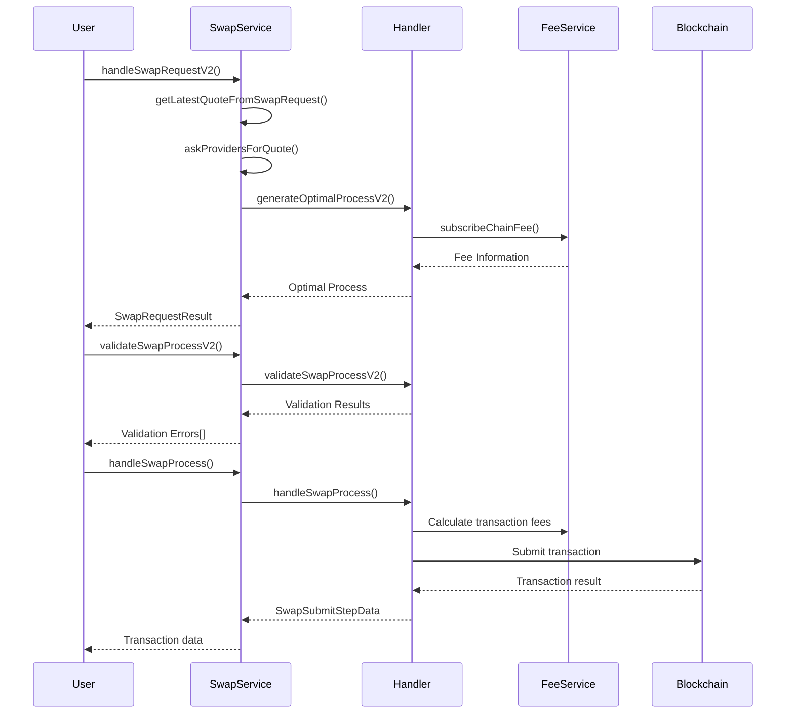

### Service Lifecycle Flow

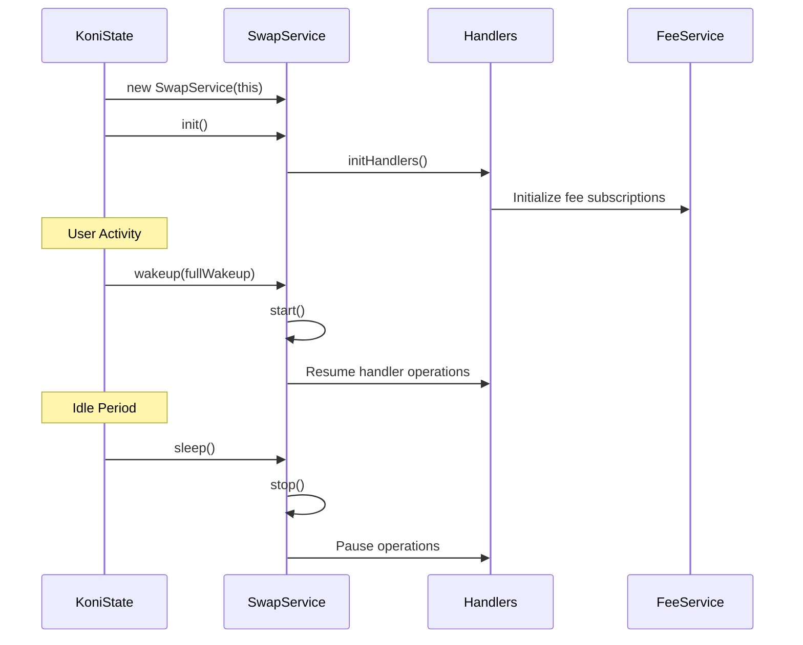

### Cross-Chain Swap Flow

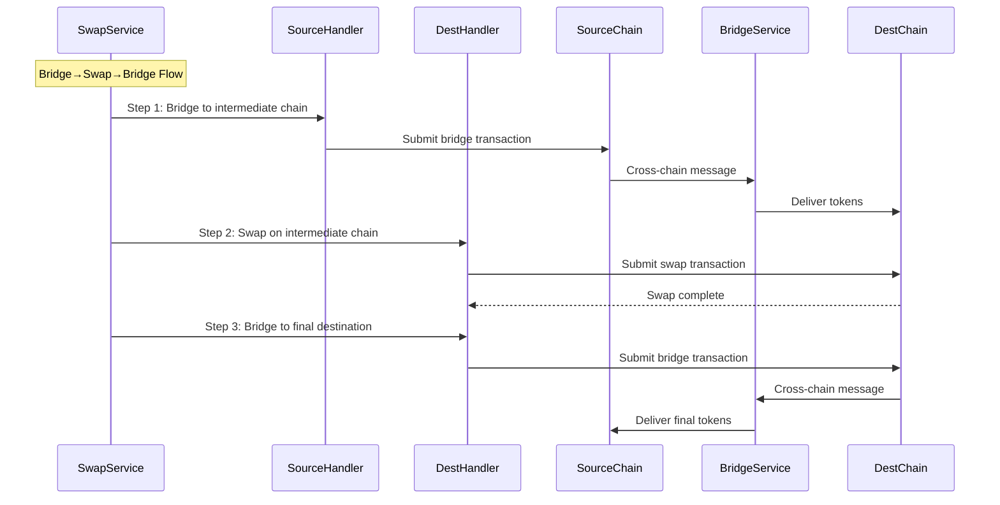

## Provider-Specific Swap Flows

### Uniswap Swap Flow

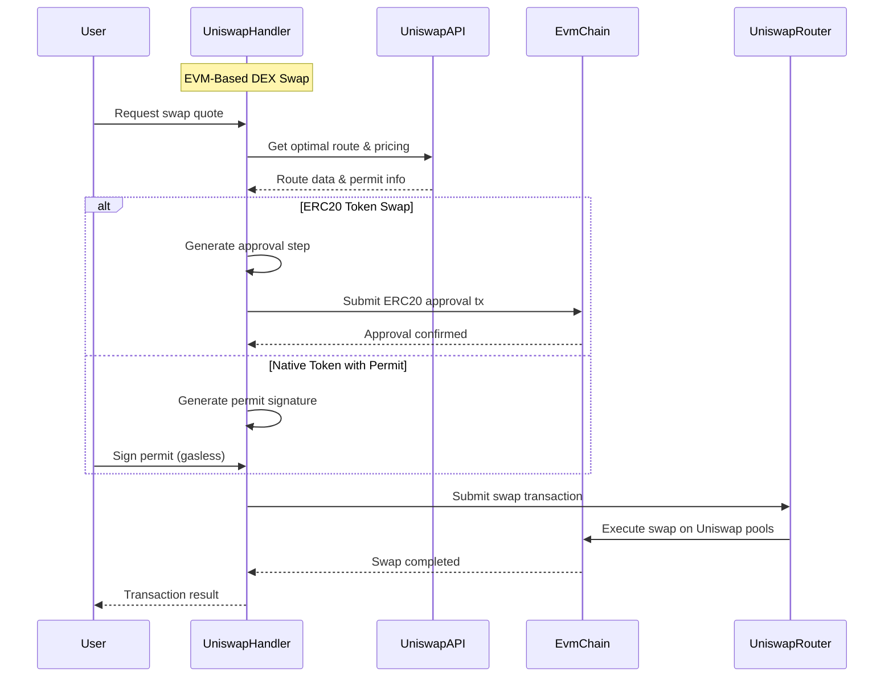

### Kyber Aggregator Flow

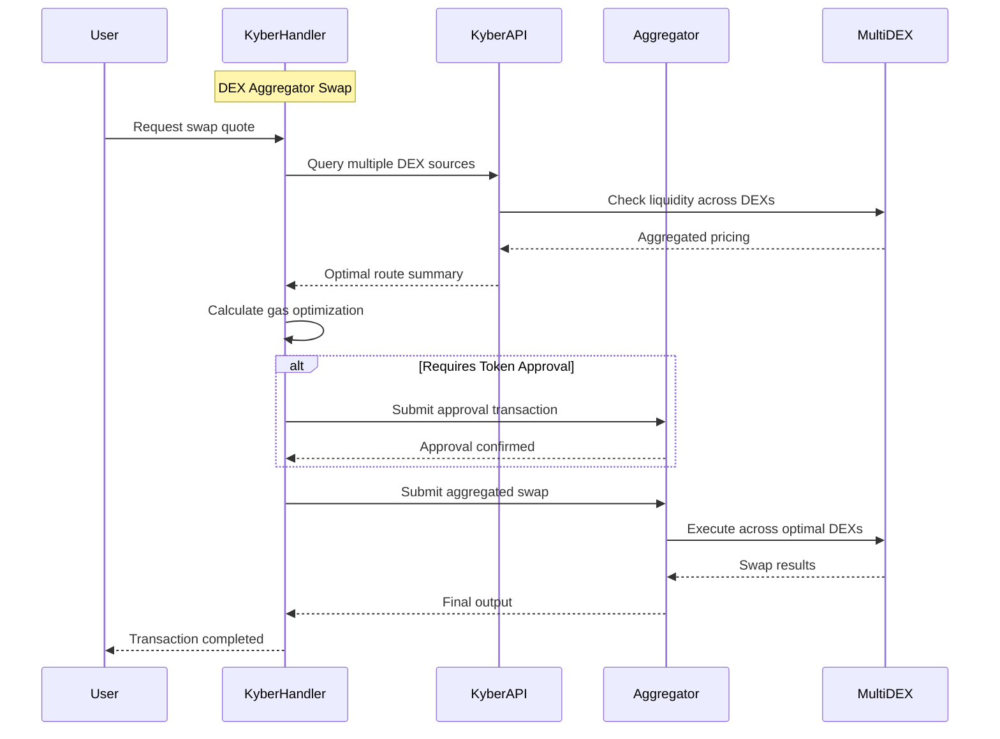

### HydraDX Native Pallet Flow

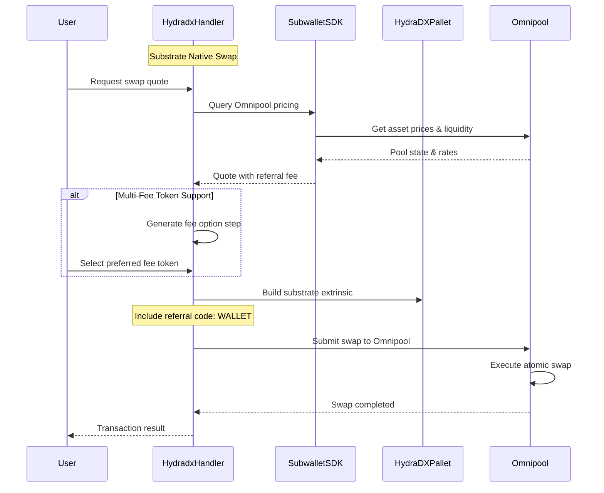

### Chainflip Atomic Swap Flow

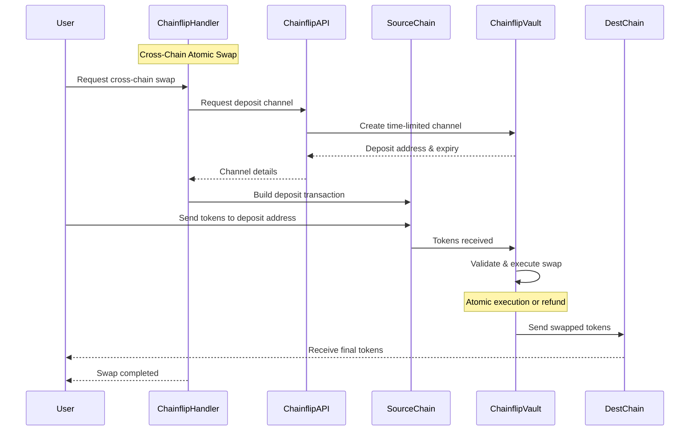

### Asset Hub Native Pool Flow

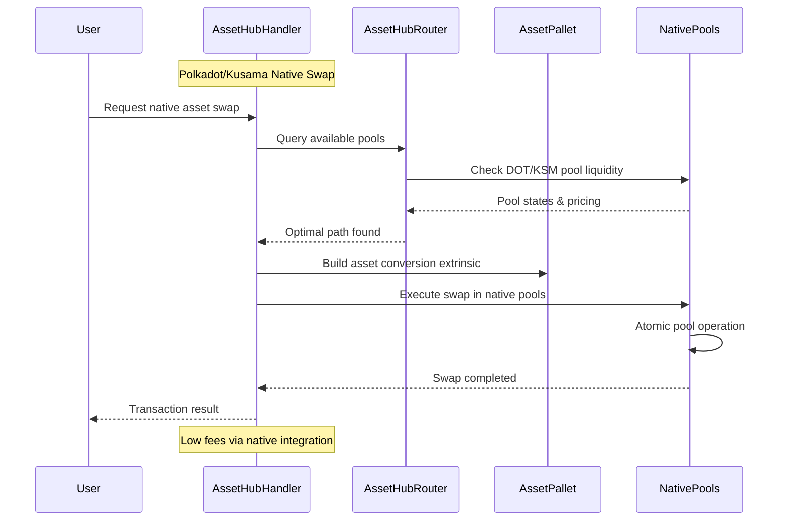

### SimpleSwap Centralized Bridge Flow

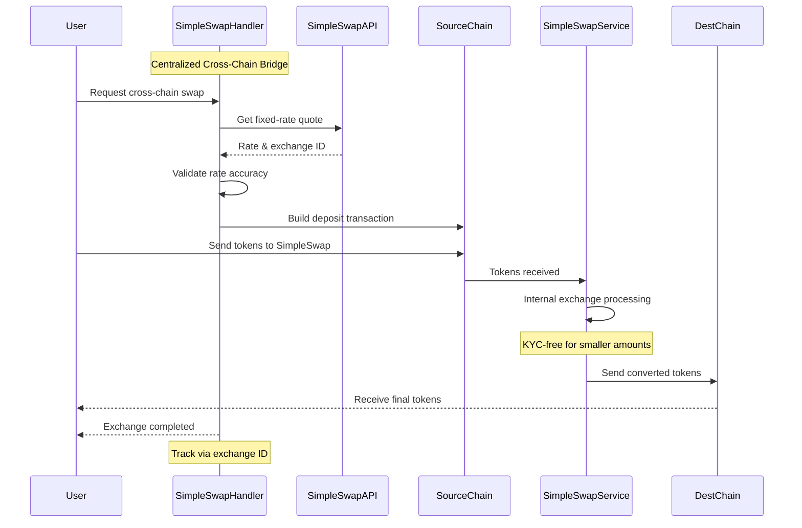

### Fee Calculation Flow

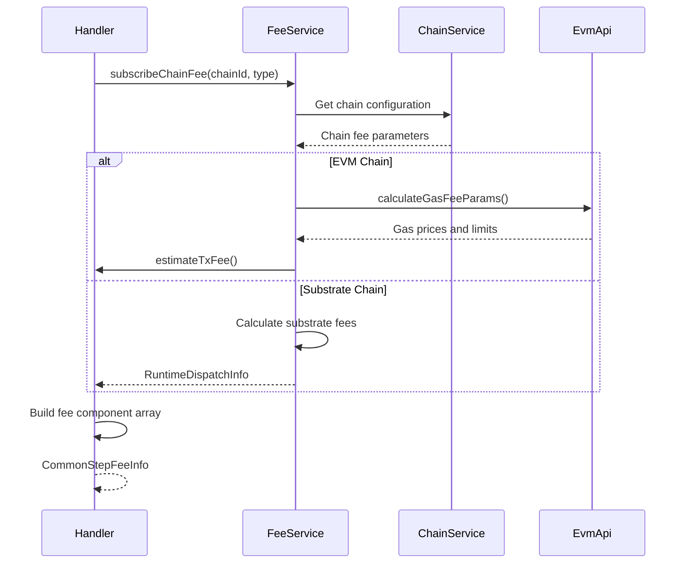

## Notes

### Supported Chain Matrix

Provider chain support as defined in [`utils.ts:30-45`](./utils.ts#L30-45):

| Provider | Mainnet Chains | Testnet Chains |
|----------|---------------|----------------|
| **Uniswap** | Ethereum, Arbitrum | - |
| **Kyber** | Multiple EVM chains | - |
| **HydraDX** | HydraDX | HydraDX Testnet |
| **Chainflip** | Polkadot, Ethereum, Arbitrum | Chainflip Polkadot, Ethereum Sepolia |
| **AssetHub** | Polkadot AssetHub, Kusama AssetHub | Westend AssetHub, Rococo AssetHub |
| **SimpleSwap** | Bittensor, Ethereum, Polkadot | - |

### Provider Capability Matrix

| Feature | Uniswap | Kyber | HydraDX | Chainflip | AssetHub | SimpleSwap |
|---------|---------|-------|---------|-----------|----------|------------|
| **Same-Chain Swaps** | ✅ | ✅ | ✅ | ❌ | ✅ | ❌ |
| **Cross-Chain Swaps** | ✅* | ❌ | ❌ | ✅ | ❌ | ✅ |
| **Gasless Permits** | ✅ | ❌ | ❌ | ❌ | ❌ | ❌ |
| **Multi-Fee Tokens** | ❌ | ❌ | ✅ | ❌ | ❌ | ❌ |
| **Referral System** | ❌ | ❌ | ✅ | ❌ | ❌ | ❌ |
| **Atomic Guarantees** | ❌ | ❌ | ✅ | ✅ | ✅ | ❌ |
| **KYC Required** | ❌ | ❌ | ❌ | ❌ | ❌ | Partial |

*Via Across Protocol integration

### Known Issues

1. **Quote Timeout Handling**: Quotes have limited validity periods defined in [`SWAP_QUOTE_TIMEOUT_MAP`](./utils.ts#L25), requiring refresh for expired quotes

2. **Cross-Chain Complexity**: Multi-step processes (Bridge→Swap→Bridge) require careful balance management and may fail if intermediate steps don't receive sufficient tokens

3. **Fee Estimation Accuracy**: EVM fee estimation may be inaccurate during network congestion, potentially causing transaction failures

4. **Service Lifecycle Dependencies**: SwapService depends on proper initialization order as defined in [`State.ts:396`](../../koni/background/handlers/State.ts#L396)

5. **Provider-Specific Limitations**:
   - **Chainflip**: Deposit channel expiry can cause failed swaps if not executed promptly
   - **SimpleSwap**: Centralized nature creates single point of failure risk
   - **Uniswap**: MEV vulnerability during high-value swaps without proper protection
   - **HydraDX**: Limited to Substrate ecosystem for native operations

### Future Improvements

1. **Enhanced Path Finding**: Implement more sophisticated algorithms to find optimal multi-hop routes with better cost analysis

2. **Fee Optimization**: Dynamic fee adjustment based on network conditions and user preferences

3. **Failure Recovery**: Implement automatic retry mechanisms and partial execution recovery for failed multi-step swaps

4. **Quote Caching**: Implement intelligent quote caching to reduce API calls while maintaining accuracy

5. **Service Isolation**: Better separation between swap service lifecycle and main application state

6. **Provider Enhancements**:
   - **Multi-Provider Aggregation**: Combine quotes from multiple providers for optimal pricing
   - **Smart Route Optimization**: AI-powered route selection based on historical performance
   - **Dynamic Provider Weighting**: Adjust provider selection based on success rates and user preferences
   - **Cross-Chain MEV Protection** : Implement MEV protection for cross-chain swaps
   - **Gas Price Optimization**: Dynamic gas price adjustment based on network conditions

### Provider Priority Logic

The service prioritizes providers based on:
- **Amount Received**: Higher output amounts get priority at [`index.ts:433`](./index.ts#L433)
- **Provider Preference**: ChainFlip and Uniswap get slight priority for equal amounts
- **User Selection**: `preferredProvider` parameter overrides automatic selection at [`index.ts:445`](./index.ts#L445)

### Cross-Chain Support

Current cross-chain capabilities as implemented in [`utils.ts`](./utils.ts):
- **XCM**: Substrate-to-Substrate transfers within same consensus
- **Across Protocol**: EVM cross-chain bridging  
- **SimpleSwap**: Centralized cross-chain swapping
- **Chainflip**: Atomic cross-chain swaps

### Configuration Integration

The service integrates with:
- **Blocked Actions**: Checks [`fetchBlockedConfigObjects()`](../../constants) for maintenance mode at [`index.ts:556`](./index.ts#L556)
- **Environment Settings**: Uses state integration for configuration
- **Chain State**: Monitors active chains via [`ChainService.getChainStateByKey()`](../chain-service) through KoniState

### Handler Initialization

Provider initialization occurs at [`index.ts:457-514`](./index.ts#L457-514):
- **Testnet/Mainnet Support**: Chainflip and Hydradx handlers support both environments
- **Chain-Specific Handlers**: AssetHub handlers configured per specific chain (Polkadot, Kusama, Westend)
- **Transaction Service Integration**: Uniswap and Kyber handlers require transaction service dependency

### Utility Functions

Key utility functions from [`utils.ts`](./utils.ts):
- `getSupportedSwapChains()` - Returns supported chain list
- `calculateSwapRate()` - Rate calculation with decimal adjustment
- `getAmountAfterSlippage()` - Slippage-adjusted amount calculation
- `isChainsHasSameProvider()` - Provider compatibility checking
