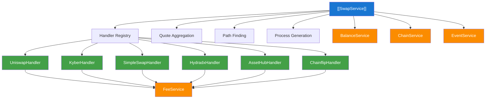
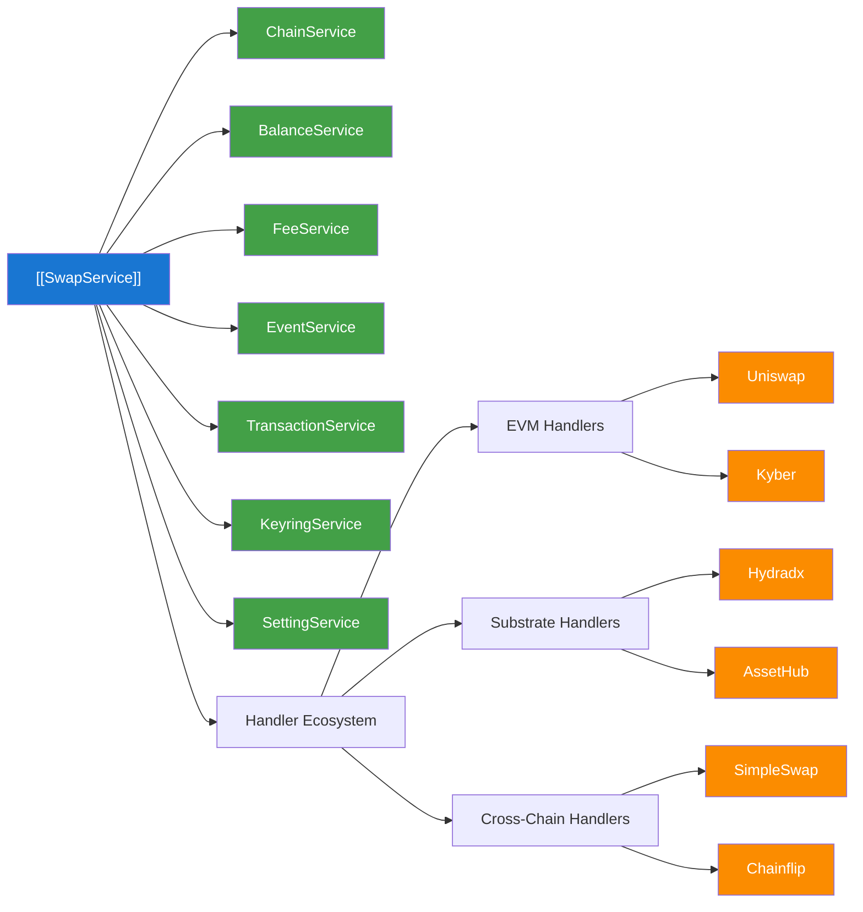
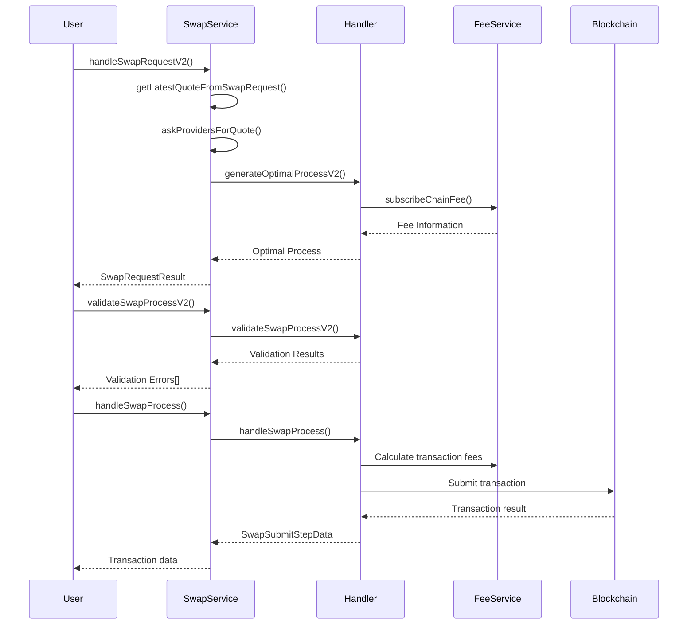
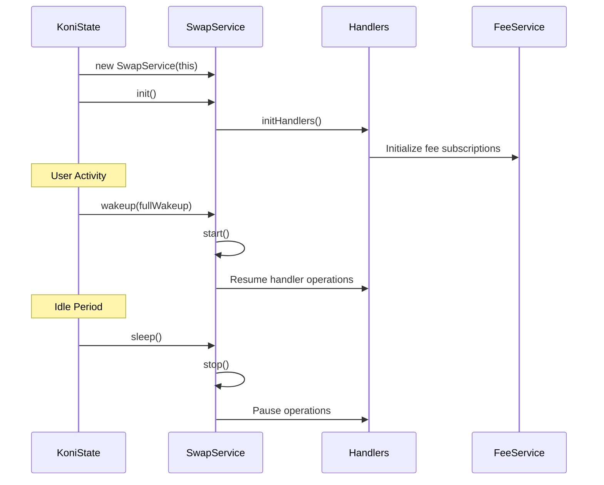
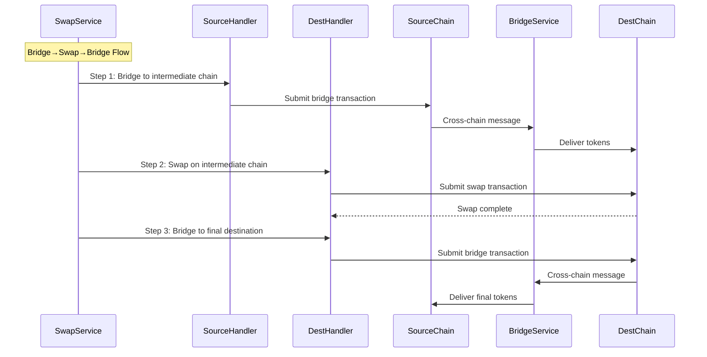
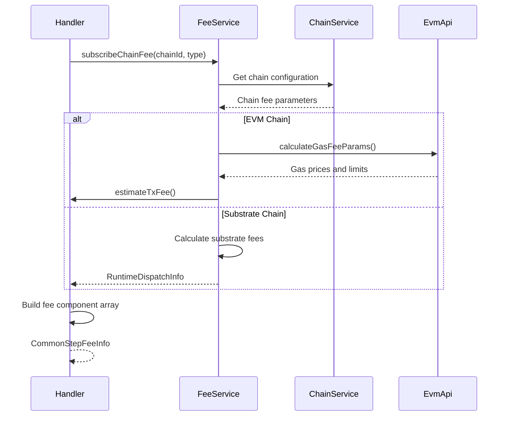

# Swap Service Documentation

## Overview

The Swap Service is a comprehensive token swapping system that supports multiple decentralized exchange (DEX) providers and cross-chain bridging capabilities. It orchestrates token swaps across different blockchain networks with automatic path finding, quote optimization, and fee calculation.

## Architecture

### High-Level Architecture

### Service Relationships

### Component Roles

#### SwapService (Main Orchestrator)
- **Location**: [`/packages/extension-base/src/services/swap-service/index.ts`](./index.ts)
- **Initialization**: Integrated into KoniState at [`/packages/extension-base/src/koni/background/handlers/State.ts:120`](../../koni/background/handlers/State.ts#L120)
- **Purpose**: Central coordinator for all swap operations
- **Responsibilities**:
  - Handler registration and management
  - Quote aggregation from multiple providers
  - Optimal path finding and process generation
  - Swap pair management and subscription
  - Cross-chain routing logic

#### Handler Architecture
All handlers implement the `SwapBaseInterface` defined in [`/packages/extension-base/src/services/swap-service/handler/base-handler.ts`](./handler/base-handler.ts):

- **UniswapHandler**: EVM-based swaps with permit functionality and approval management
- **KyberHandler**: EVM DEX aggregator with gas optimization and quote routing
- **SimpleSwapHandler**: Cross-chain swaps via centralized bridge with native/ERC20 support
- **HydradxHandler**: Substrate-based AMM with referral system and fee token selection
- **AssetHubHandler**: Polkadot/Kusama asset hub native swaps with router integration
- **ChainflipHandler**: Cross-chain atomic swaps with testnet/mainnet configurations

#### SwapBaseHandler (Shared Logic)
- **Location**: [`/packages/extension-base/src/services/swap-service/handler/base-handler.ts`](./handler/base-handler.ts)
- **Purpose**: Provides common functionality for all handlers
- **Features**:
  - Bridge step generation and validation
  - Cross-chain transfer handling (XCM and Across)
  - Balance and fee validation
  - Process validation patterns

## Props

### Key Interfaces

#### SwapRequestV2
- **Purpose**: Main request object for swap operations
- **Type**: Interface from [`@subwallet/extension-base/types`](../../types)
- **Properties**:
  - `address: string` - User wallet address
  - `pair: ActionPair` - Token pair for swapping
  - `fromAmount: string` - Amount to swap from
  - `slippage: number` - Acceptable slippage percentage
  - `recipient?: string` - Optional recipient address
  - `isSupportKyberVersion?: boolean` - Kyber compatibility flag

#### SwapBaseInterface
- **Purpose**: Contract for all swap handler implementations
- **Type**: Interface from [`./handler/base-handler.ts`](./handler/base-handler.ts)
- **Required Methods**:
  - `generateOptimalProcessV2()` - Process generation
  - `handleSwapProcess()` - Transaction execution
  - `validateSwapProcessV2()` - Process validation

#### DynamicSwapAction
- **Purpose**: Represents individual steps in swap process
- **Type**: Interface from [`@subwallet/extension-base/types`](../../types)
- **Properties**:
  - `action: DynamicSwapType` - SWAP or BRIDGE
  - `pair: ActionPair` - Token pair for the action

### Fee Integration Properties

#### CommonStepFeeInfo
- **Purpose**: Fee information for each process step
- **Type**: Interface from [`@subwallet/extension-base/types/service-base`](../../types/service-base)
- **Properties**:
  - `feeComponent: SwapFeeComponent[]` - Array of fee components
  - `defaultFeeToken: string` - Default token for paying fees
  - `feeOptions: string[]` - Available fee token options
  - `selectedFeeToken?: string` - User-selected fee token

#### SwapFeeComponent
- **Purpose**: Individual fee component details
- **Properties**:
  - `feeType: SwapFeeType` - NETWORK_FEE, BRIDGE_FEE, etc.
  - `amount: string` - Fee amount in token units
  - `tokenSlug: string` - Token identifier for fee payment

### State Integration Properties

#### KoniState Integration
- **Purpose**: Integration with main application state
- **Location**: [`/packages/extension-base/src/koni/background/handlers/State.ts:120`](../../koni/background/handlers/State.ts#L120)
- **Initialization**: `this.swapService = new SwapService(this)`
- **Service Lifecycle**: 
  - Initialized after balance and earning services at [`State.ts:396`](../../koni/background/handlers/State.ts#L396)
  - Started with other services at [`State.ts:1627`](../../koni/background/handlers/State.ts#L1627)
  - Stopped during sleep mode at [`State.ts:1661`](../../koni/background/handlers/State.ts#L1661)

## Methods

### Core Service Methods

#### `handleSwapRequestV2(request: SwapRequestV2): Promise<SwapRequestResult>`
- **Purpose**: Main entry point for swap requests
- **Input**: SwapRequestV2 object with user parameters
- **Output**: SwapRequestResult with optimal process and quotes
- **Implementation**: Located at [`index.ts:214`](./index.ts#L214)
- **Process**:
  1. Find available swap paths using path finding algorithms
  2. Request quotes from all compatible providers
  3. Select optimal quote based on output amount and provider priority
  4. Generate step-by-step process for execution

#### `generateOptimalProcessV2(params: OptimalSwapPathParamsV2): Promise<CommonOptimalSwapPath>`
- **Purpose**: Creates optimal execution process for selected quote
- **Input**: Parameters including request, selected quote, and path
- **Output**: CommonOptimalSwapPath with steps and fee information
- **Implementation**: Located at [`index.ts:177`](./index.ts#L177)
- **Delegation**: Routes to appropriate handler based on provider ID

#### `validateSwapProcessV2(params: ValidateSwapProcessParams): Promise<TransactionError[]>`
- **Purpose**: Validates swap process before execution
- **Input**: Process parameters and selected quote
- **Output**: Array of validation errors (empty if valid)
- **Implementation**: Located at [`index.ts:538`](./index.ts#L538)
- **Validation**: Balance checks, fee validation, blocked action checks

### Handler-Specific Methods

#### UniswapHandler Methods
- **Location**: [`./handler/uniswap-handler.ts`](./handler/uniswap-handler.ts)
- `getApprovalStep()` - Generates ERC20 approval transactions
- `getPermitStep()` - Handles gasless permit signatures  
- `getSubmitStep()` - Creates swap transaction
- `getBridgeStep()` - Manages cross-chain bridging via Across

#### KyberHandler Methods  
- **Location**: [`./handler/kyber-handler.ts`](./handler/kyber-handler.ts)
- `getApprovalStep()` - ERC20 token approval with allowance checking
- `getSubmitStep()` - Kyber swap transaction building
- **Fee Integration**: Uses `FeeService.subscribeChainFee()` at [`kyber-handler.ts:279`](./handler/kyber-handler.ts#L279)

#### HydradxHandler Methods
- **Location**: [`./handler/hydradx-handler.ts`](./handler/hydradx-handler.ts)
- `getFeeOptionStep()` - Fee token selection for multi-token payment
- `getSubmitStep()` - Substrate extrinsic creation with referral support
- **Special Features**: Referral code integration and fee token management

### Fee Service Integration Methods

#### `FeeService.subscribeChainFee(id: string, chain: string, type: string): Promise<FeeInfo>`
- **Purpose**: Gets current fee information for specific chain
- **Usage**: Used by handlers to calculate transaction fees
- **Implementation**: Called in handlers like [`kyber-handler.ts:279`](./handler/kyber-handler.ts#L279)

#### `estimateTxFee(tx: TransactionConfig, evmApi: EvmApi, feeInfo: EvmFeeInfo): Promise<string>`
- **Purpose**: Estimates transaction fee for EVM transactions
- **Usage**: Used for approval and swap transactions
- **Implementation**: Called in handlers for gas estimation

### State Integration Methods

#### Service Lifecycle Management
- **Implementation**: Located at [`State.ts:1589-1691`](../../koni/background/handlers/State.ts#L1589-1691)
- `wakeup()` - Resumes swap service from sleep mode
- `sleep()` - Pauses swap service to conserve resources
- **Full Startup**: Services started at [`State.ts:1627`](../../koni/background/handlers/State.ts#L1627)

### Path Finding Methods

#### `getAvailablePath(request: SwapRequestV2): [DynamicSwapAction[], SwapRequestV2 | undefined]`
- **Purpose**: Finds available swap paths for token pairs
- **Implementation**: Located at [`index.ts:272`](./index.ts#L272)
- **Logic**:
  1. Direct swap if tokens on same chain with DEX support
  2. Bridge→Swap if bridge transit available to destination
  3. Swap→Bridge if swap transit available from source  
  4. Bridge→Swap→Bridge for complex multi-hop scenarios

## Flows

### Swap Process Lifecycle

### Service Lifecycle Flow

### Cross-Chain Swap Flow

### Fee Calculation Flow

## Notes

### Known Issues

1. **Quote Timeout Handling**: Quotes have limited validity periods defined in [`SWAP_QUOTE_TIMEOUT_MAP`](./utils.ts#L25), requiring refresh for expired quotes

2. **Cross-Chain Complexity**: Multi-step processes (Bridge→Swap→Bridge) require careful balance management and may fail if intermediate steps don't receive sufficient tokens

3. **Fee Estimation Accuracy**: EVM fee estimation may be inaccurate during network congestion, potentially causing transaction failures

4. **Service Lifecycle Dependencies**: SwapService depends on proper initialization order as defined in [`State.ts:396`](../../koni/background/handlers/State.ts#L396)

### Future Improvements

1. **Enhanced Path Finding**: Implement more sophisticated algorithms to find optimal multi-hop routes with better cost analysis

2. **Fee Optimization**: Dynamic fee adjustment based on network conditions and user preferences

3. **Failure Recovery**: Implement automatic retry mechanisms and partial execution recovery for failed multi-step swaps

4. **Quote Caching**: Implement intelligent quote caching to reduce API calls while maintaining accuracy

5. **Service Isolation**: Better separation between swap service lifecycle and main application state

### Provider Priority Logic

The service prioritizes providers based on:
- **Amount Received**: Higher output amounts get priority at [`index.ts:433`](./index.ts#L433)
- **Provider Preference**: ChainFlip and Uniswap get slight priority for equal amounts
- **User Selection**: `preferredProvider` parameter overrides automatic selection at [`index.ts:445`](./index.ts#L445)

### Cross-Chain Support

Current cross-chain capabilities as implemented in [`utils.ts`](./utils.ts):
- **XCM**: Substrate-to-Substrate transfers within same consensus
- **Across Protocol**: EVM cross-chain bridging  
- **SimpleSwap**: Centralized cross-chain swapping
- **Chainflip**: Atomic cross-chain swaps

### Configuration Integration

The service integrates with:
- **Blocked Actions**: Checks [`fetchBlockedConfigObjects()`](../../constants) for maintenance mode at [`index.ts:556`](./index.ts#L556)
- **Environment Settings**: Uses state integration for configuration
- **Chain State**: Monitors active chains via [`ChainService.getChainStateByKey()`](../chain-service) through KoniState

### Handler Initialization

Provider initialization occurs at [`index.ts:457-514`](./index.ts#L457-514):
- **Testnet/Mainnet Support**: Chainflip and Hydradx handlers support both environments
- **Chain-Specific Handlers**: AssetHub handlers configured per specific chain (Polkadot, Kusama, Westend)
- **Transaction Service Integration**: Uniswap and Kyber handlers require transaction service dependency

### Utility Functions

Key utility functions from [`utils.ts`](./utils.ts):
- `getSupportedSwapChains()` - Returns supported chain list
- `calculateSwapRate()` - Rate calculation with decimal adjustment
- `getAmountAfterSlippage()` - Slippage-adjusted amount calculation
- `isChainsHasSameProvider()` - Provider compatibility checking
