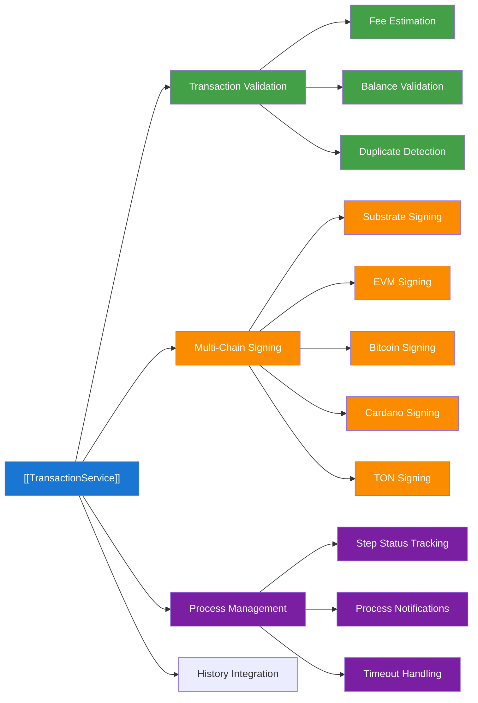
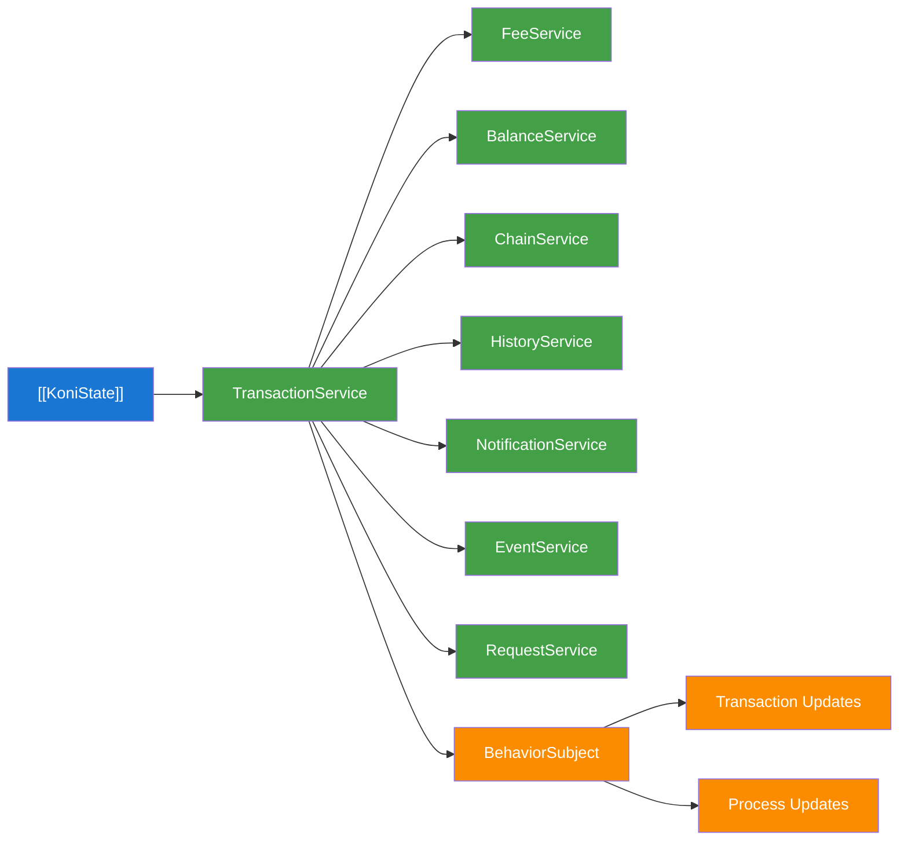
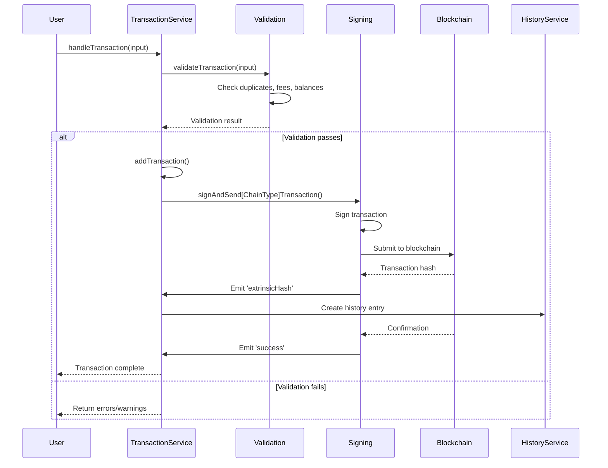
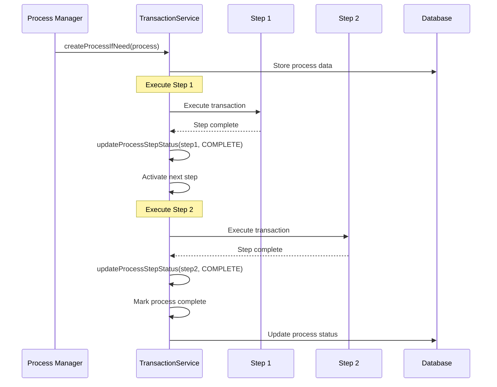
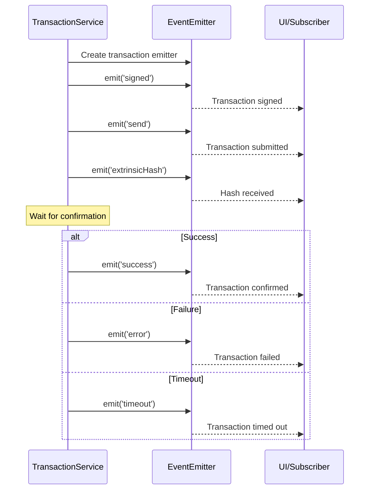

# Transaction Service Documentation

## Overview

The Transaction Service is a comprehensive blockchain transaction management system that handles transaction validation, signing, submission, and monitoring across multiple blockchain types including Substrate, EVM, Bitcoin, Cardano, and TON networks. It provides unified transaction processing with support for multi-step processes, fee estimation, and real-time status tracking.

## Architecture

### High-Level Architecture



### Service Dependencies



### Component Roles

#### TransactionService (Main Service)
- **Location**: [`./index.ts`](./index.ts)
- **Initialization**: Created in KoniState at [`State.ts:119`](../../koni/background/handlers/State.ts#L119)
- **Purpose**: Central coordinator for all blockchain transaction operations
- **Responsibilities**:
  - Transaction validation and preprocessing
  - Multi-chain transaction signing and submission
  - Transaction status monitoring and updates
  - Process management for multi-step operations
  - Integration with other services

#### Transaction State Management
- **Transaction Subject**: BehaviorSubject at [`index.ts:49`](./index.ts#L49)
- **Process Subject**: BehaviorSubject at [`index.ts:50`](./index.ts#L50)
- **Purpose**: Reactive state management for real-time transaction and process updates
- **Features**: Observable streams for UI synchronization

#### Multi-Chain Support
- **Substrate Transactions**: Polkadot/Kusama ecosystem support
- **EVM Transactions**: Ethereum-compatible chain support with gas optimization
- **Bitcoin Transactions**: PSBT-based transaction handling
- **Cardano Transactions**: UTxO model transaction support
- **TON Transactions**: Telegram Open Network integration

## Props

### Core Transaction Types

#### SWTransactionInput
- **Purpose**: Input configuration for transaction creation
- **Type**: Interface from [`./types.ts`](./types.ts)
- **Properties**:
  - `address: string` - Sender address
  - `chain: string` - Target blockchain
  - `chainType: ChainType` - Blockchain type (substrate/evm/bitcoin/cardano/ton)
  - `extrinsicType: ExtrinsicType` - Transaction type
  - `data: unknown` - Transaction-specific data
  - `estimateFee?: AmountData` - Fee estimation

#### SWTransactionResponse
- **Purpose**: Transaction validation and processing result
- **Type**: Interface from [`./types.ts`](./types.ts)
- **Properties**:
  - `id?: string` - Transaction identifier
  - `extrinsicHash?: string` - Transaction hash
  - `status?: ExtrinsicStatus` - Current status
  - `errors: TransactionError[]` - Validation/execution errors
  - `warnings: TransactionError[]` - Non-blocking warnings

#### TransactionEventResponse
- **Purpose**: Event data for transaction lifecycle events
- **Type**: Interface from [`./types.ts`](./types.ts)
- **Properties**:
  - `id: string` - Transaction ID
  - `extrinsicHash?: string` - Transaction hash
  - `blockHash?: string` - Block hash when included
  - `blockNumber?: number` - Block number
  - `errors: TransactionError[]` - Any errors encountered

### Process Management Types

#### ProcessTransactionData
- **Purpose**: Multi-step transaction process information
- **Type**: Interface from [`@subwallet/extension-base/types`](../../types)
- **Properties**:
  - `id: string` - Process identifier
  - `status: StepStatus` - Overall process status
  - `steps: ProcessStep[]` - Individual process steps
  - `currentStepId: number` - Active step identifier

#### BriefProcessStep
- **Purpose**: Step reference for process updates
- **Type**: Interface from [`@subwallet/extension-base/types`](../../types)
- **Properties**:
  - `processId: string` - Parent process ID
  - `stepId: number` - Step sequence number

### State Integration Properties

#### KoniState Integration
- **Purpose**: Integration with main application state
- **Constructor**: `new TransactionService(this)` at [`State.ts:119`](../../koni/background/handlers/State.ts#L119)
- **Access**: Available as `this.transactionService` throughout KoniState

## Methods

### Core Transaction Methods

#### `validateTransaction(transactionInput: SWTransactionInput): Promise<SWTransactionResponse>`
- **Purpose**: Validates transaction before execution
- **Implementation**: Located at [`index.ts:77`](./index.ts#L77)
- **Validation Steps**:
  1. Duplicate transaction detection at [`index.ts:64`](./index.ts#L64)
  2. Feature and action support validation
  3. Chain connectivity verification
  4. Fee estimation via FeeService integration
  5. Balance sufficiency checks
  6. Custom validation via `additionalValidator`
- **Output**: Complete validation response with errors/warnings

#### `handleTransaction(transaction: SWTransactionInput): Promise<SWTransactionResponse>`
- **Purpose**: Complete transaction processing pipeline
- **Implementation**: Located at [`index.ts:246`](./index.ts#L246)
- **Process Flow**:
  1. Transaction validation
  2. Error/warning evaluation
  3. Transaction submission via `addTransaction()`
  4. Promise-based completion handling
- **Error Handling**: Comprehensive error categorization and user feedback

#### `addTransaction(inputTransaction: SWTransactionInput): Promise<TransactionEmitter>`
- **Purpose**: Adds transaction to processing queue
- **Implementation**: Located at [`index.ts:222`](./index.ts#L222)
- **Features**:
  - Automatic transaction ID generation
  - State subject updates
  - Event emitter creation for lifecycle tracking

### Multi-Chain Signing Methods

#### `signAndSendEvmTransaction(transaction: SWTransaction): Promise<TransactionEmitter>`
- **Purpose**: EVM transaction signing and submission
- **Implementation**: Located at [`index.ts:615`](./index.ts#L615)
- **Features**:
  - Contract interaction parsing at [`index.ts:630`](./index.ts#L630)
  - Gas fee optimization
  - External/injected wallet support
  - Transaction receipt monitoring

#### `signAndSendSubstrateTransaction(transaction: SWTransaction): TransactionEmitter`
- **Purpose**: Substrate transaction signing and submission
- **Implementation**: Located at [`index.ts:857`](./index.ts#L857)
- **Features**:
  - Multi-asset fee payment support
  - Tip handling for priority transactions
  - Event log parsing for transaction details
  - Automatic retry on network issues

#### `signAndSendBitcoinTransaction(transaction: SWTransaction): TransactionEmitter`
- **Purpose**: Bitcoin PSBT transaction signing
- **Implementation**: Located at [`index.ts:1184`](./index.ts#L1184)
- **Features**:
  - PSBT validation and signing
  - UTXO management
  - Fee calculation optimization

#### `signAndSendCardanoTransaction(transaction: SWTransaction): TransactionEmitter`
- **Purpose**: Cardano transaction processing
- **Implementation**: Located at [`index.ts:1112`](./index.ts#L1112)
- **Features**:
  - UTxO model handling
  - Multi-asset transaction support
  - Network-specific address validation

#### `signAndSendTonTransaction(transaction: SWTransaction): TransactionEmitter`
- **Purpose**: TON blockchain transaction processing
- **Implementation**: Located at [`index.ts:1019`](./index.ts#L1019)
- **Features**:
  - Cell-based message construction
  - Sequence number management
  - External message handling

### Account-Specific Signing Methods

#### PASSWORD Accounts
- **Signing Method**: `keyring.unlockPair(address)` → `request.sign(registry, pair)`
- **Process**: Local keyring signing with encrypted private key
- **Timing**: Immediate (< 1 second)

#### LEDGER Accounts  
- **Signing Method**: Hardware device communication via USB/Bluetooth
- **Special Steps**:
  1. Device connection verification
  2. Transaction data display on Ledger screen
  3. Physical confirmation button press required
  4. Signature retrieval from secure element
- **Process**: External hardware signing with manual confirmation
- **Timing**: 5-30 seconds (user interaction required)

#### QR Accounts
- **Signing Method**: Air-gapped QR code workflow
- **Process**: 
  1. Generate QR code with transaction data
  2. External device scans and signs
  3. Signature returned via QR code scan
- **Timing**: Variable (depends on external device)

#### INJECTED Accounts
- **Signing Method**: External wallet extension communication
- **Process**: Request forwarded to connected browser wallet
- **Timing**: Depends on external wallet response

**Key Point**: All account types receive identical transaction requests. Only the signing implementation differs.

### Substrate Ledger Request Customization

Substrate transactions require specific transformations for Ledger devices based on runtime state.

#### Runtime-Based Enhancement

```typescript
// Base request (same for all account types)
const basePayload: SignerPayloadJSON = {
  address: account.address,
  method: extrinsic.method.toHex(),
  nonce: transaction.nonce,
  genesisHash: chain.genesisHash,
  // ... other standard fields
};

// Ledger enhancement based on runtime
const isRuntimeUpdated = _isRuntimeUpdated(basePayload.signedExtensions);

const ledgerPayload = isRuntimeUpdated ? {
  ...basePayload,
  mode: 1,                           // Ledger signing mode
  withSignedTransaction: true,       // Enable transaction reconstruction
  metadataHash: calculateMetadataHash(chain.metadata)
} : basePayload;
```

#### Metadata Processing

Modern runtimes require metadata compression for Ledger:

```typescript
const payloadU8a = payload.toU8a(true);

if (isRuntimeUpdated) {
  // Compress metadata for Ledger display
  const blob = u8aToHex(payloadU8a);
  const { txMetadata: shortener } = await shortenMetadata(chainSlug, blob);
  const metadata = hexToU8a(shortener);
} else {
  // No metadata needed for legacy runtime
  const metadata = new Uint8Array(0);
}

// Sign with processed metadata
const { signature } = await ledgerSignTransaction(payloadU8a, metadata, ...accountInfo);
```

#### Transaction Reconstruction

For modern runtime with `withSignedTransaction: true`:

```typescript
if (addExtraData) {
  // Build complete signed extrinsic
  const extrinsic = payload.registry.createType('Extrinsic', { method: payload.method }, { version: 4 });
  extrinsic.addSignature(account.address, signature, payload.toHex());
  
  return { signature, signedTransaction: extrinsic.toHex() };
} else {
  return { signature };
}
```

### Process Management Methods

#### `createProcessIfNeed(process: ProcessTransactionData): Promise<void>`
- **Purpose**: Creates new multi-step process if needed
- **Implementation**: Located at [`index.ts:1367`](./index.ts#L1367)
- **Database Integration**: Persists process data via `dbService.upsertProcessTransaction()`

#### `updateProcessStepStatus(step: BriefProcessStep, data: ProcessStepUpdate): void`
- **Purpose**: Updates individual step status within process
- **Implementation**: Located at [`index.ts:1383`](./index.ts#L1383)
- **Status Management**:
  - Progress tracking through step states
  - Automatic next step activation
  - Failure cascade handling
  - Timeout detection and recovery

#### `updateProcessInfo(id: string, combineInfo: unknown, step?: ProcessStep): Promise<void>`
- **Purpose**: Updates process metadata and step information
- **Implementation**: Located at [`index.ts:1457`](./index.ts#L1457)

### Specialized Transaction Methods

#### `handlePermitTransaction(transaction: SWPermitTransactionInput): Promise<SWTransactionResponse>`
- **Purpose**: EIP-2612 permit signature handling for gasless approvals
- **Implementation**: Located at [`index.ts:325`](./index.ts#L325)
- **Use Case**: DEX trading with gasless token approvals

#### `handleDutchTransaction(transaction: SWDutchTransactionInput): Promise<SWTransactionResponse>`
- **Purpose**: Dutch auction transaction processing
- **Implementation**: Located at [`index.ts:373`](./index.ts#L373)
- **Features**: Order submission with continuous monitoring

### State Management Methods

#### `getTransaction(id: string): SWTransactionBase`
- **Purpose**: Retrieves transaction by ID
- **Implementation**: Located at [`index.ts:62`](./index.ts#L62)

#### `getTransactionSubject(): BehaviorSubject<Record<string, SWTransactionBase>>`
- **Purpose**: Access to reactive transaction state
- **Implementation**: Located at [`index.ts:144`](./index.ts#L144)

#### `get observables()` and `get values()`
- **Purpose**: Reactive and synchronous access to state
- **Implementation**: Located at [`index.ts:147-174`](./index.ts#L147-174)
- **Returns**: Observable streams and current values for transactions and processes

## Flows

### Transaction Processing Lifecycle



### Multi-Step Process Flow



### Transaction Event Lifecycle



## Notes

### Known Issues

1. **Transaction Timeout Handling**: Fixed timeout of 30 seconds defined in [`constants.ts`](./constants.ts) may be insufficient for congested networks.

2. **Fee Estimation Accuracy**: EVM fee estimation at [`index.ts:700`](./index.ts#L700) may be inaccurate during network congestion.

3. **Process Recovery**: Limited recovery mechanisms for failed multi-step processes, requiring manual intervention.

4. **Memory Management**: Long-running processes may accumulate in memory without proper cleanup mechanisms.

5. **One-Sign Process Limitations**: The one-sign feature for multi-step processes requires PASSWORD account authentication mode and must be enabled in settings at [`Extension.ts:4976`](../../koni/background/handlers/Extension.ts#L4976). It only works with processes having 3 or more steps (because first step is empty) to optimize user experience for complex multi-step operations like cross-chain swapping and yield farming.

### Future Improvements

1. **Dynamic Timeout Management**: Implement network-aware timeout adjustments based on historical confirmation times.

2. **Enhanced Error Recovery**: Add automatic retry mechanisms with exponential backoff for transient failures.

3. **Process Resumption**: Implement process checkpoint and resumption capabilities for interrupted operations.

4. **Performance Optimization**: Add transaction batching and parallel processing for improved throughput.

5. **Advanced Fee Management**: Implement dynamic fee adjustment based on network conditions and user preferences.

### Transaction Types Support

The service supports these extrinsic types:
- **Transfers**: Native and token transfers with XCM support
- **Staking**: Bonding, unbonding, rewards, and pool operations
- **NFT Operations**: Minting, transferring, and marketplace interactions
- **DeFi Operations**: Swapping, liquidity provision, yield farming
- **Governance**: Voting, proposals, and treasury interactions
- **Smart Contracts**: EVM contract interactions and deployments

### Multi-Chain Features

- **Cross-Chain Transfers**: XCM and bridge protocol support
- **Universal Fee Payment**: Multi-asset fee payment on supported chains
- **Network Switching**: Automatic network detection and switching
- **Address Formatting**: Chain-specific address format handling

### One-Sign Multi-Step Process

The transaction service supports automatic signing for multi-step processes through the **One-Sign** feature, designed to streamline complex operations without requiring manual confirmation for each transaction step.

#### Requirements
- **Account Type**: Only available for PASSWORD authentication mode accounts (checked at [`Extension.ts:4969`](../../koni/background/handlers/Extension.ts#L4969))
- **Setting Enabled**: User must enable "Allow One Sign" in security settings (default: `true` from [`constants.ts`](../setting-service/constants.ts))
- **Minimum Steps**: Process must have 3 or more steps (because first step is empty) to qualify for one-sign automation (validated at [`Extension.ts:5053`](../../koni/background/handlers/Extension.ts#L5053))

#### Supported Process Types
- **SWAP**: Multi-step token swapping with automatic XCM transfers and approvals
- **EARNING**: Cross-chain yield farming operations requiring token transfers and staking

#### Process Flow
1. **Initial Validation**: Verify account compatibility and settings at [`Extension.ts:4960-4978`](../../koni/background/handlers/Extension.ts#L4960-4978)
2. **Automatic Step Execution**: Sequential transaction submission without user prompts
3. **XCM Wait Logic**: Automatic waiting for cross-chain transfers to complete before next step (60-second timeout or balance confirmation)
4. **Error Propagation**: Any step failure stops the entire process and returns errors

#### Technical Implementation
- **Entry Point**: `handleSubmitProcessTransaction()` method at [`Extension.ts:4959`](../../koni/background/handlers/Extension.ts#L4959)
- **Loop Logic**: Recursive step execution with balance monitoring for XCM operations
- **Process Management**: Integration with [`TransactionService.createProcessIfNeed()`](./index.ts#L1367) for state tracking

#### User Experience Benefits
- **Reduced Friction**: Eliminates repetitive signing for complex operations
- **Time Efficiency**: Automatic execution with intelligent waiting for cross-chain confirmations
- **Transparent Progress**: Real-time step status updates through process subscription

### Integration Points

The service integrates with:
- **FeeService**: For accurate fee estimation and optimization
- **BalanceService**: For balance validation and updates
- **HistoryService**: For transaction history and analytics
- **NotificationService**: For user notifications and alerts
- **EventService**: For system-wide event coordination
- **ChainService**: For blockchain connectivity and metadata

### Error Handling Patterns

The service implements comprehensive error handling:
- **Validation Errors**: Pre-submission validation with user-friendly messages
- **Network Errors**: Automatic retry and fallback mechanisms
- **User Rejection**: Graceful handling of user-cancelled transactions
- **Timeout Handling**: Configurable timeouts with appropriate user feedback
- **Balance Errors**: Insufficient balance detection with suggested actions

### Testing

Transaction service testing includes:
- Unit tests for individual methods and validation logic
- Integration tests with blockchain networks
- End-to-end transaction flow testing
- Error scenario validation
- Multi-step process testing

Run tests with:
```bash
npm test -- transaction-service
```
