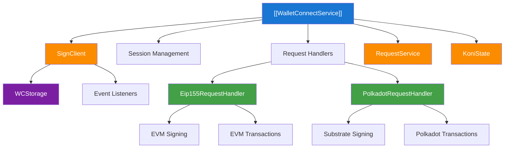
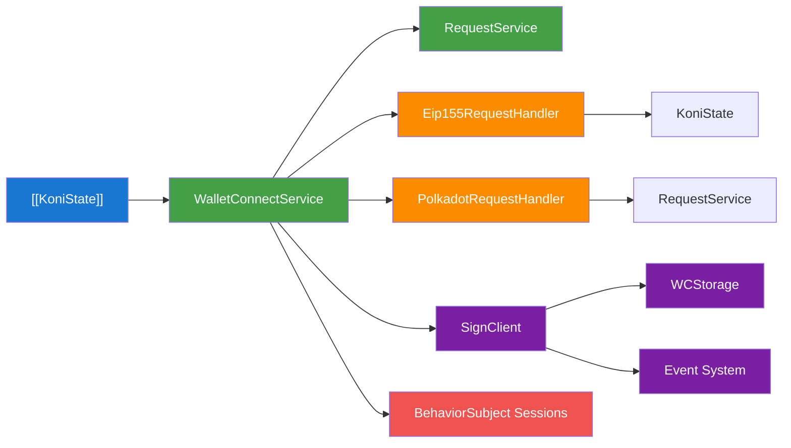
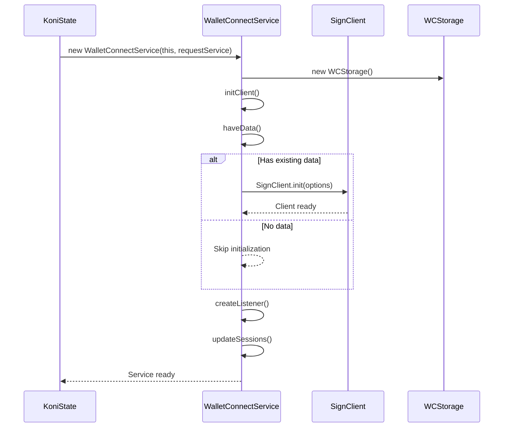
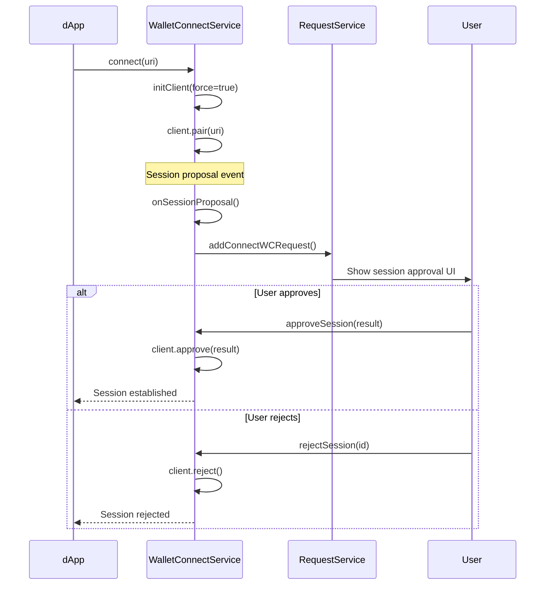
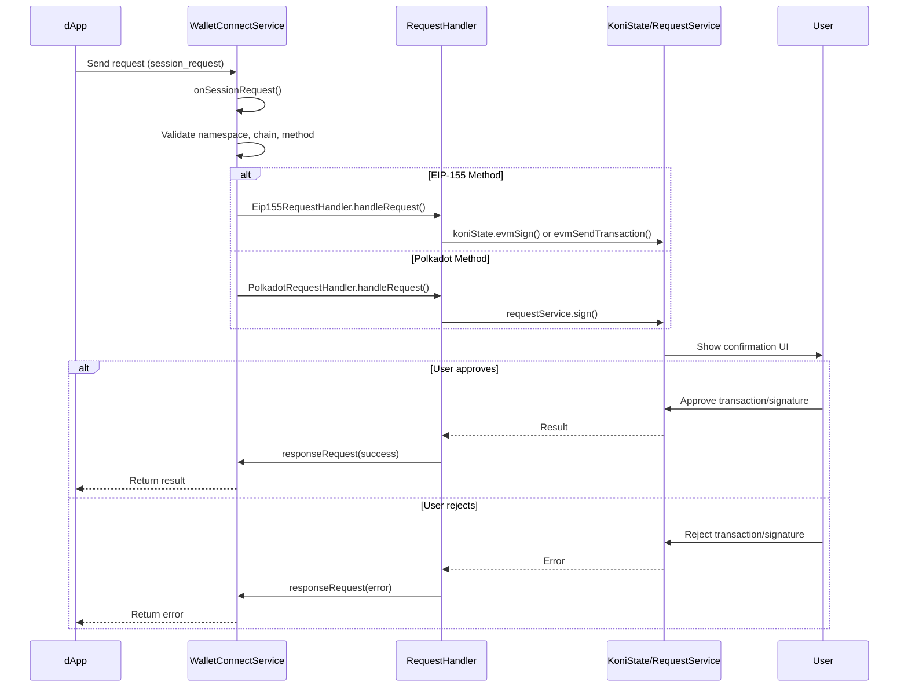
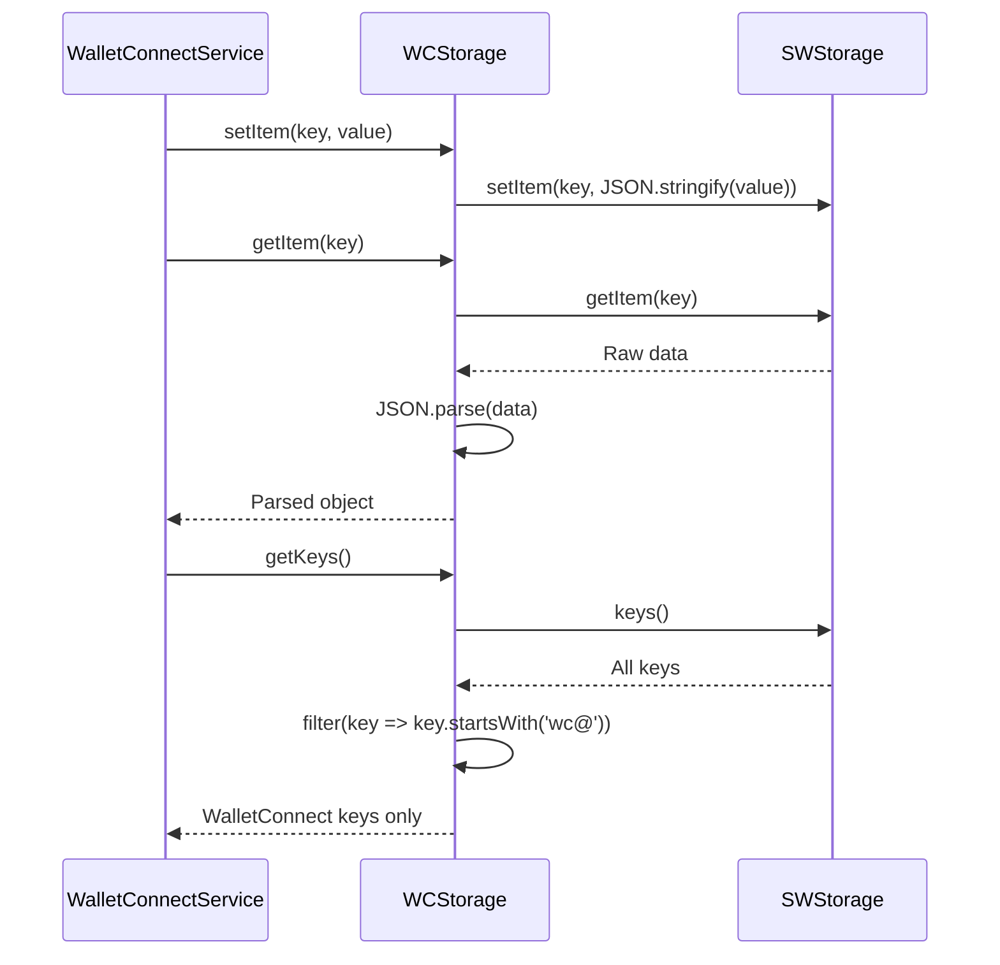

# Wallet Connect Service Documentation

## Overview

The Wallet Connect Service provides integration with WalletConnect v2 protocol, enabling decentralized applications (dApps) to interact with SubWallet through secure peer-to-peer connections. The service supports both EIP-155 (Ethereum) and Polkadot signing methods, session management, and cross-chain transaction handling.

## Architecture

### High-Level Architecture

### Service Dependencies

### Component Roles

#### WalletConnectService (Main Service)
- **Location**: [`./index.ts`](./index.ts)
- **Initialization**: Created in KoniState at [`State.ts:129`](../../koni/background/handlers/State.ts#L129)
- **Purpose**: Central coordinator for WalletConnect protocol integration
- **Responsibilities**:
  - Session proposal and approval management
  - Request routing to appropriate handlers
  - Storage management through custom WCStorage implementation
  - Event subscription and lifecycle management

#### Request Handlers
- **PolkadotRequestHandler**: Located at [`./handler/PolkadotRequestHandler.ts`](./handler/PolkadotRequestHandler.ts)
  - Handles Polkadot/Substrate signing methods
  - Manages message signing and transaction signing for Polkadot chains
- **Eip155RequestHandler**: Located at [`./handler/Eip155RequestHandler.ts`](./handler/Eip155RequestHandler.ts)
  - Handles EIP-155 (Ethereum) signing methods
  - Manages EVM message signing and transaction sending

#### Storage Implementation
- **WCStorage**: Custom implementation at [`index.ts:23`](./index.ts#L23)
- **Purpose**: Bridges WalletConnect storage requirements with SubWallet's SWStorage system
- **Features**: Prefixed key storage with 'wc@' prefix for isolation

## Props

### Core Configuration Properties

#### SignClientTypes.Options
- **Purpose**: Configuration for WalletConnect SignClient initialization
- **Type**: Interface from [`@walletconnect/types`](https://www.npmjs.com/package/@walletconnect/types)
- **Default**: [`DEFAULT_WALLET_CONNECT_OPTIONS`](./constants.ts#L8)
- **Properties**:
  - `projectId: string` - WalletConnect project identifier
  - `relayUrl: string` - Relay server URL with fallback support
  - `metadata: object` - SubWallet application metadata
  - `storage: IKeyValueStorage` - Custom storage implementation

#### WalletConnect Signing Method Enums
- **EIP155_SIGNING_METHODS**: Ethereum signing methods at [`types.ts:12`](./types.ts#L12)
  - `PERSONAL_SIGN`, `ETH_SIGN`, `ETH_SEND_TRANSACTION`, etc.
- **POLKADOT_SIGNING_METHODS**: Polkadot signing methods at [`types.ts:23`](./types.ts#L23)
  - `POLKADOT_SIGN_TRANSACTION`, `POLKADOT_SIGN_MESSAGE`

### Request Type Properties

#### WalletConnectSessionRequest
- **Purpose**: Session proposal request structure
- **Type**: Interface from [`./types.ts`](./types.ts#L7)
- **Properties**:
  - `request: SignClientTypes.EventArguments['session_proposal']` - WalletConnect session proposal
  - `id: string` - Unique request identifier
  - `url: string` - Requesting dApp URL

#### WalletConnectParamMap
- **Purpose**: Type mapping for different signing method parameters
- **Type**: Interface from [`./types.ts`](./types.ts#L36)
- **Usage**: Ensures type safety for request parameter parsing

### State Integration Properties

#### SessionTypes.Struct[]
- **Purpose**: Active WalletConnect sessions management
- **Implementation**: BehaviorSubject at [`index.ts:58`](./index.ts#L58)
- **Access**: Available through `sessionSubject` for reactive updates

## Methods

### Core Service Methods

#### `initClient(force?: boolean): Promise<void>`
- **Purpose**: Initializes or reinitializes the WalletConnect SignClient
- **Input**: `force` - Optional flag to force reinitialization
- **Implementation**: Located at [`index.ts:75`](./index.ts#L75)
- **Features**: 
  - Fallback relay URL support at [`index.ts:81`](./index.ts#L81)
  - Data persistence checking at [`index.ts:63`](./index.ts#L63)
  - Event listener management

#### `connect(uri: string): Promise<void>`
- **Purpose**: Establishes connection with dApp using WalletConnect URI
- **Input**: `uri` - WalletConnect connection URI from dApp
- **Implementation**: Located at [`index.ts:168`](./index.ts#L168)
- **Timeout**: 20 seconds as defined in [`constants.ts:35`](./constants.ts#L35)
- **Auto-initialization**: Ensures client is ready before pairing

#### `approveSession(result: ResultApproveWalletConnectSession): Promise<void>`
- **Purpose**: Approves a session proposal with specified namespaces and methods
- **Input**: `result` - Approval parameters including namespaces and methods
- **Implementation**: Located at [`index.ts:178`](./index.ts#L178)
- **Features**: Automatic method completion for required EVM/DOT methods

#### `rejectSession(id: number): Promise<void>`
- **Purpose**: Rejects a session proposal
- **Input**: `id` - Session proposal ID
- **Implementation**: Located at [`index.ts:193`](./index.ts#L193)

#### `disconnect(topic: string): Promise<void>`
- **Purpose**: Disconnects an active session
- **Input**: `topic` - Session topic identifier
- **Implementation**: Located at [`index.ts:270`](./index.ts#L270)

### Session Management Methods

#### `getSession(topic: string): SessionTypes.Struct`
- **Purpose**: Retrieves session information by topic
- **Input**: `topic` - Session topic identifier
- **Output**: Session structure or throws error if not found
- **Implementation**: Located at [`index.ts:149`](./index.ts#L149)

#### `get sessions(): SessionTypes.Struct[]`
- **Purpose**: Gets all active sessions
- **Output**: Array of active session structures
- **Implementation**: Located at [`index.ts:92`](./index.ts#L92)

### Request Handling Methods

#### `responseRequest(response: EngineTypes.RespondParams): Promise<void>`
- **Purpose**: Sends response back to dApp for a specific request
- **Input**: `response` - Response parameters including topic and result/error
- **Implementation**: Located at [`index.ts:203`](./index.ts#L203)

### Advanced Management Methods

#### `resetWallet(resetAll: boolean): Promise<void>`
- **Purpose**: Resets WalletConnect state and disconnects all sessions
- **Input**: `resetAll` - Whether to reset all data or just WalletConnect data
- **Implementation**: Located at [`index.ts:210`](./index.ts#L210)
- **Features**: Graceful session/pairing disconnection with error handling

### State Integration Methods

#### State Integration
- **Initialization**: Created at [`State.ts:129`](../../koni/background/handlers/State.ts#L129)
- **Constructor**: `new WalletConnectService(this, this.requestService)`
- **Access**: Available as `this.walletConnectService` throughout KoniState

## Flows

### Service Initialization Flow

### Session Connection Flow

### Request Handling Flow

### Storage Management Flow

## Notes

### Known Issues

1. **Relay Connection Stability**: The service implements fallback relay URL support at [`index.ts:81`](./index.ts#L81) to handle primary relay failures.

2. **Session Timeout Handling**: Connection establishment has a 20-second timeout defined in [`constants.ts:35`](./constants.ts#L35) to prevent hanging connections.

3. **Method Compatibility**: The service automatically adds missing required methods during session approval at [`index.ts:185`](./index.ts#L185).

4. **Storage Isolation**: WalletConnect data uses 'wc@' prefix in storage to avoid conflicts with other SubWallet data.

### Future Improvements

1. **Enhanced Error Handling**: Implement more granular error categorization and recovery mechanisms for network failures.

2. **Session Persistence**: Improve session restoration after application restarts or network interruptions.

3. **Multi-Chain Support**: Extend support for additional blockchain networks beyond EIP-155 and Polkadot.

4. **Request Batching**: Implement batching for multiple simultaneous requests from the same dApp.

5. **Security Enhancements**: Add additional validation layers for cross-chain transactions and sensitive operations.

### Configuration Best Practices

1. **Project ID Management**: Use environment-specific project IDs defined in [`constants.ts:2-3`](./constants.ts#L2-3).

2. **Relay Configuration**: Configure both primary and fallback relay URLs for improved reliability.

3. **Method Support**: Ensure all required methods are included in [`WALLET_CONNECT_SUPPORTED_METHODS`](./constants.ts#L16).

4. **Chain Validation**: Implement proper chain validation using [`isSupportWalletConnectChain()`](./helpers.ts#L61).

### Supported Methods

The service supports these WalletConnect methods:
- **EIP-155**: Personal sign, typed data signing, transaction sending
- **Polkadot**: Message signing, transaction signing
- **Chain Support**: Validated through [`isSupportWalletConnectChain()`](./helpers.ts#L61)

### Integration Points

The service integrates with these SubWallet components:
- **RequestService**: For confirmation UI and user approval flows
- **KoniState**: For EVM transaction handling and account management
- **SWStorage**: For persistent data storage with prefix isolation
- **EventService**: For session state updates and reactive programming

### Error Handling

Error responses are formatted according to WalletConnect specifications:
- **User Rejection**: `USER_REJECTED` error code
- **Unsupported Methods**: `UNSUPPORTED_METHODS` error code
- **Invalid Chains**: `UNSUPPORTED_CHAINS` error code
- **Network Errors**: Automatic fallback and retry mechanisms

### Testing

The service can be tested with:
- WalletConnect v2 compatible dApps
- Test networks supported by SubWallet
- Session proposal and request scenarios
- Multi-chain transaction flows
